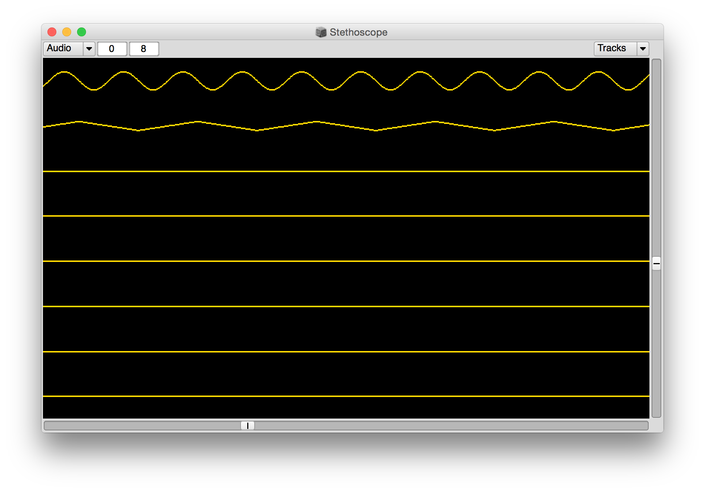

# Supercollider
*Spring 2018*

Note: anything in between carrots (`<` to `>`) denotes user input or user key commands.

*Quick reference links*

[Supercollider](https://supercollider.github.io/), this is the main SC page these days.

[Docs](http://doc.sccode.org/), the docs will be installed on your machine with the application, but they can be accessed here as well.

[The SC Book](http://www.supercolliderbook.net/), the best book on SC (this website contains all of the code from the book, btw).

[SCCode](http://sccode.org/), a web-platform for sharing and remixing supercollider code.

[SCTweets](http://sctweets.tumblr.com/), supercollider code in 140 characters or less (frequently amazing).

[SC Mailing List](http://www.birmingham.ac.uk/facilities/ea-studios/research/supercollider/mailinglist.aspx), this is the main place to go for support other than the docs. All of the devs are very active on this list and respond quickly to questions.

## Download
Go [here](https://supercollider.github.io/download.html) to download SuperCollider. Once your download is complete, go ahead and install.

## About
Supercollider is made up of two applications: a language interpreter and one or more synthesis servers. All communication between the `lang` (short for language) and the `server` is done via [OpenSoundControl](http://opensoundcontrol.org/).

## Starting the server
In order to make sound the server must be running. Type the following into a new window (`<Command+N>` makes a new window) and then hit `<Shift + Enter>` on the same line to execute the code:

```supercollider
s.boot;
```

Here `s` refers to the `localhost` server on your CPU.

`s.boot;` generally results in something like this in the post window:

```supercollider
booting server 'localhost' on address: 127.0.0.1:57110
Number of Devices: 17
   0 : "Built-in Microph"
   1 : "Built-in Output"
   2 : "After Effects 10.5"
   3 : "After Effects 11.0"
   4 : "After Effects 11.0.1"
   5 : "After Effects 11.0.2"
   6 : "After Effects 12.0"
   7 : "After Effects 12.2"
   8 : "After Effects 13.0"
   9 : "Prelude 1.0"
   10 : "Prelude 2.0"
   11 : "Premiere Pro 5.5"
   12 : "Premiere Pro 6.0"
   13 : "Premiere Pro 7.0"
   14 : "Premiere Pro 8.0"
   15 : "MOTU UltraLite mk3 Hybrid"
   16 : "Aggregate Device"

"MOTU UltraLite mk3 Hybrid" Input Device
   Streams: 4
      0  channels 8
      1  channels 2
      2  channels 2
      3  channels 2

"MOTU UltraLite mk3 Hybrid" Output Device
   Streams: 4
      0  channels 2
      1  channels 8
      2  channels 2
      3  channels 2

SC_AudioDriver: sample rate = 44100.000000, driver's block size = 512
SuperCollider 3 server ready.
Requested notification messages from server 'localhost'
localhost: server process's maxLogins (1) matches with my options.
localhost: keeping clientID (0) as confirmed by server process.
Shared memory server interface initialized
```

One can quit the server by executing the following code:

```supercollider
s.quit;
```

## Functions
Similar to most other programming language, Functions in SC are denoted by the use of curly brackets. Anything between `{ }` is a function.

*For Example*

```supercollider
f = { "hello world!".postln; };
f.value;
```

The first line of code stores the function at `f`, whereas the second line returns the `value` (in this case, prints the message "hello world!" to the post window) associated with the function.

## Arguments and Variables within Functions
Arguments allow one to pass values to a function when the function is called.

*For Example*

```supercollider
(
f = { arg a, b;
    a - b;
};
f.value(5, 3);
)
```

In the above code, evaluating the `f.value(5, 3)` results in the number `2` at the post.

And, of course, one can also use variables in functions.

*For Example*

```supercollider
(
f = { arg a, b;
    var firstResult, finalResult;
    firstResult = a + b;
    finalResult = firstResult * 2;
    finalResult;
};
f.value(2, 3);    // this will return (2 + 3) * 2 = 10
)
```

## Making Sound
Functions are used to make sound in SC. Execute the line below and, when you want it to stop, just type `<Command + .>`.

```supercollider
{ SinOsc.ar(440, 0, 0.2) }.play;
```

The code above plays a [Sine Wave](https://en.wikipedia.org/wiki/Sine_wave) with a frequency of 440Hz and an amplitude of 0.2 (amplitude, or what one can think of as volume, is generally kept within the range 0.0 to 1.0 in SC).

SC allows one to plot sounds like this onto a graph with `.plot`. This is useful if your sound is less deterministic than the above or if you need to check why something you are trying to do is inaudible or whatever.

*For Example*
```supercollider
{ SinOsc.ar(440, 0, 0.2) }.plot;
```

Which will result in this:


SC also has an oscilloscope method (`.scope`) which will display the changing waveform while playing it:

*For Example*

```supercollider
{ SinOsc.ar(440, 0, 0.2);
    LFTri.ar( 440, 0, 0.2 ); }.scope;
```

Which will result in this:


While `.plot` plots the function over time, and `.scope` shows a real-time plot of the waveform, both of those methods are generally used for testing and not for performance or recording.

## .play

`.play` simply tells the server to start a process. The result of that process depends on the function.

*For Example*

```supercollider
{ SinOsc.ar(440, 0, 0.2) }.play;
```

So, `{ ... }` returns a function (which can be killed with `.stop`), whereas `{ ... }.play` returns a `Synth` object. `Synth` objects do not have a `.stop` method, so one must either `.free` or `.release` them in order to stop the sound.

*For Example*

```supercollider
x = { SinOsc.ar(440, 0, 0.2) }.play;
//lets wait a moment
x.release;
```
Interestingly enough, one can call `.scope` on the entire output of the server. Think of this like putting everything that is currently happening in SC through an oscilloscope.

*For Example*

```supercollider
{ [SinOsc.ar(440, 0, 0.4), LFTri.ar(220, 0.0, 0.2) ] }.play;
s.scope;
```
results in:



## Ugens

`UGens` can be used to output audio (with the `.ar`, or audio rate, class method) or control information (with the `.kr`, or control rate, class method).

*For Example*

```supercollider
(
{ var ampOsc;
    ampOsc = SinOsc.kr(0.5, 1.5pi, 0.5, 0.5);
    SinOsc.ar(440, 0, ampOsc);
}.play;
)
```

In the above example, the `SinOsc` `UGen` is used both as control rate (to change the amplitude of the sounding `SinOsc`) and as audio rate (to actually play the `Sine` tone).

Another example that uses Mouse location (both x and y axes) for frequency and amplitude:

```supercollider
{ SinOsc.ar(MouseY.kr( 50, 2000), 0.0, MouseX.kr( 0.0,1.0 )); }.scope;
```

## Additive Synthesis

Additive Synthesis is a general term that refers to the technique of playing more than one sound simultaneously to create a more complex sound. This is also typically referred to as "summing" signals.

*For Example*

```supercollider
{ SinOsc.ar( 440, 0.0, 0.5 ) + PinkNoise.ar( 0.1 ) + Crackle.ar( 1.5, 0.4 ) + LFTri.ar( 200, 0.0, 0.2 )}.play;
```

BTW, Crackle and Dust are my absolute favorite noise UGens/Random number generators. Be careful with Crackle, it explodes easily (and this especially sucks if you are monitoring SC via headphones).

## SynthDefs

SC has an optimized way of taking in information about `UGens` and their interconnections: `SynthDef`s. A `SynthDef` tells the server how to generate audio and translates that information to byte code. You can think of a `SynthDef` and its resulting `Synth` in a similar manner that one thinks about classes and objects: a `SynthDef` is the blueprint that defines a particular instance of a playing `Synth`. Or, if you prefer, a `SynthDef` is a cake recipe and a `Synth` is the cake you end up with by following the recipe.

What follows are two versions of the same instrument: one that sustains until receiving an off message and another which has a specific duration.

### sustaining synth

```python3
SynthDef( \sin,	{ | amp = 0.0, freq = 440, out = 0, trig = 0 |
	var env, sig, finalSig;
	env = EnvGen.kr( Env.asr( 0.001, 0.9, 0.001 ), trig, doneAction: 0 );
	sig = SinOsc.ar( freq, 0.0, amp );
	finalSig = sig * env * 0.6;
	Out.ar( out, Pan2.ar(finalSig) );
}).add;

x = Synth( \sin, [ \freq, 400, \amp, 0.5]);

x.set(\trig, 1);
x.set(\trig, 0 );
s.scope;
```

Here we define a `SynthDef` named `\sin` with a `sustaining` envelope, or an envelope that plays continuously until receiving an off message. Variables are used to organize the code into chunks: `env`, short for envelope, is the portion of our code that allows us to toggle the sound on and off; `sig`, short for signal, is the portion of our code that defines what the sound is.  Multiplying the `env` by the `sig` is what results in the "on/off" functionality above and occurs in the `finalSig` line.

The resulting signal is written to a `Bus` (in this case, our speakers) in the `Out.ar` line, which also converts our `Mono` signal to `Stereo`. We will revisit this line in the future so for now don't spend too much time paying attention to it. Note: I reuse the above general structure for all sustaining sounds unless something special/unusual is needed.

To hear the `\sin` we need to create and play an instance of it, which we accomplish using `Synth`. In order to turn this instance of `\sin` off in the future we store it to the variable `x`. After running the `Synth` line, we can turn the envelope on by setting the `\trig` argument to `1`. Later we can turn our synth off by setting `\trig` to `0`. Think of these two lines as a metaphorical toggle button for `\sin`.


### deterministic synth

```python3
SynthDef( \sin,	{ | amp = 0.0, freq = 440, out = 0, sus = 1, trig = 0 |
	var env, sig, finalSig;
	env = EnvGen.kr( Env.linen( 0.001, sus, 0.001 ), trig, doneAction: 2 );
	sig = SinOsc.ar( freq, 0.0, amp );
	finalSig = sig * env * 0.6;
	Out.ar( out, Pan2.ar(finalSig) );
}).add;

Synth( \sin, [ \amp, 0.5, \freq, 400, \trig, 1]);

```

The primary difference between the `sustaining` and `deterministic` synth can be seen in their respective `env` lines. Here we use a different `Env`: `.linen`. Take a moment to compare the two `Env` (`.asr` and `.linen`) by highlighting `Env` and looking it up in the the Help `<Command+D>`.

`.linen` creates Envelopes in a trapezoidal shape. In order to calculate this shape, `.linen` needs information regarding the duration, in seconds, of each segment of its shape. One commonly refers to each segment of the shape as `attack time` (segment 1), `sustain time` (segment 2), and `release time` (segment 3). In other words, if we want our `Synth` to play for 10 seconds we would want to set each of our segments such that the total time adds up to `10`. In the above Synth we accomplish this by using super tiny numbers for `attack` and `release` and setting `sus` to 10.

The benefit here is that the envelope (and associated `Synth`) will clean itself up after it is `done` (this is set by `doneAction: 2` in the `SynthDef`), so we could run the `Synth` line repeatedly to create, for example, 5 instances of `\sin` each with a total duration of (approximately) 10 seconds. Note: I reuse the above general structure for all deterministic sounds unless something special/unusual is needed.

```
